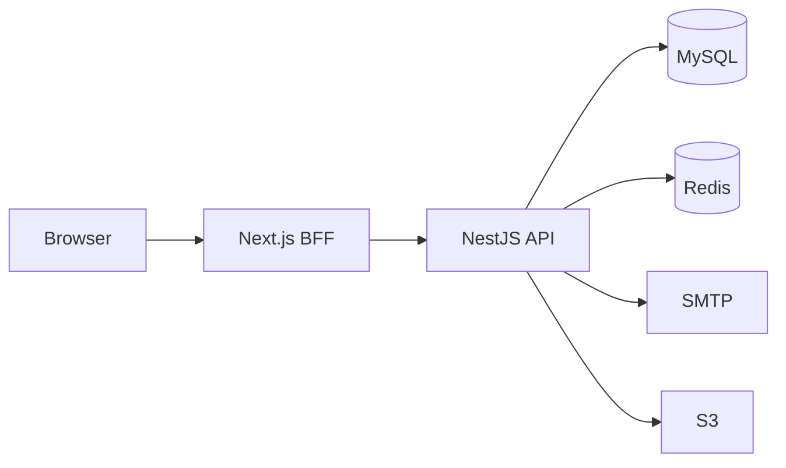
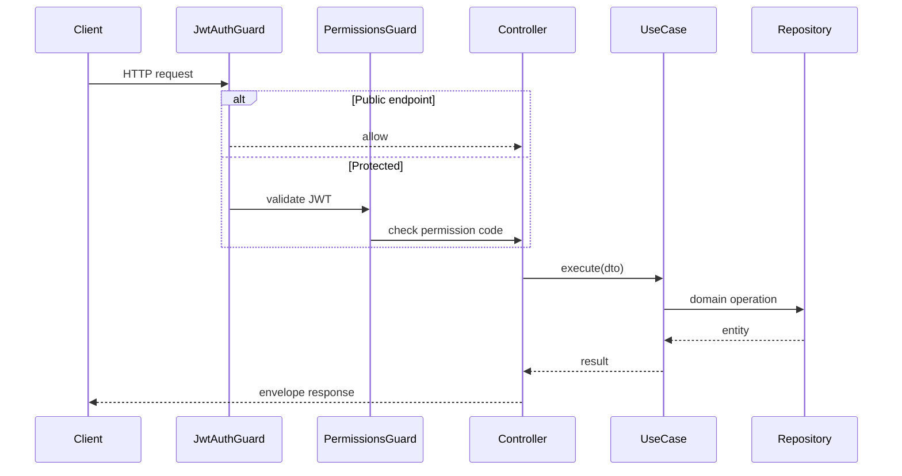

# Architecture

NestJS API following **Clean Architecture** with a dual-route design: public read endpoints (`@Public()`) and admin CRUD (`/admin/*` + JWT + permissions).

## Layer structure

```
src/
├── domain/              # Entities, repository interfaces (no Nest/ORM)
├── application/         # Use cases, ports, application DTOs
├── infrastructure/      # TypeORM, Redis, JWT, migrations, seed
├── presentation/http/   # Controllers, guards, filters, DTOs
└── shared/              # Types, localized content helpers
```

**Dependency rule:** `presentation` → `application` → `domain` ← `infrastructure`

## Registered modules (v3)

`AppModule` imports 14 presentation modules:

| Module | Responsibility |
|--------|----------------|
| Auth | Login, refresh, logout, MFA, OIDC |
| User | User CRUD, GDPR export/anonymize |
| Authorization | Roles, permissions, health |
| Brand | Brands, menu items, brand events |
| History | Company timeline |
| Leadership | Leadership members |
| Team | Team members |
| SiteSetting | Singleton site settings |
| Contact | Public form + admin inbox |
| Media | S3-compatible upload |
| Dashboard | Admin stats |
| Audit | Audit log read API |
| Blog | News posts (table: `blog_posts`) |
| Navigation | Header/footer tree CMS |

## System context



## Request flow



## Global cross-cutting

| Component | Role |
|-----------|------|
| `RequestIdMiddleware` | `X-Request-Id` on every request |
| `ResponseInterceptor` | Standard `{ success, data, timestamp, path, requestId }` envelope |
| `AuditInterceptor` | Writes mutating admin actions to `audit_logs` |
| `ThrottlerGuard` | Rate limiting (Redis-backed when enabled) |
| `JwtAuthGuard` | JWT validation; skipped for `@Public()` |
| `PermissionsGuard` | RBAC permission codes per route |

## API versioning

All routes are under `/api/v1`. See [API.md](API.md).

## Related

- [CMS Reference](CMS-REFERENCE.md) — entity model
- [ADR 001](adr/001-clean-architecture.md) — layer decision record
