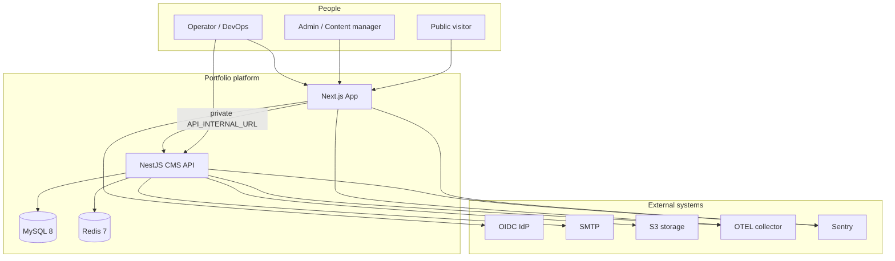
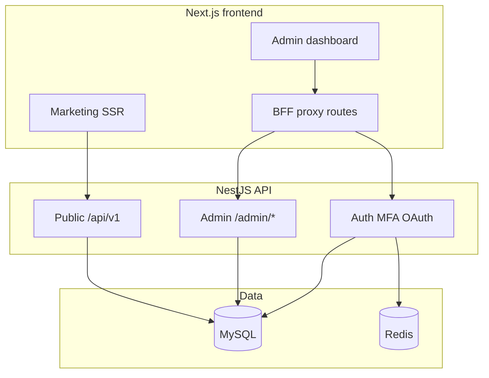

# System architecture (C4)

Unified view of the **nestjs-fsd-portfolio-template** (API) and **nextjs-fsd-portfolio-template** (web + BFF) pair.

For layer-level detail see [ARCHITECTURE.md](./ARCHITECTURE.md) (backend) and the [frontend ARCHITECTURE.md](https://github.com/devTugu/nextjs-fsd-portfolio-template/blob/main/docs/ARCHITECTURE.md).

## C4 level 1 — System context

Who interacts with the platform and which external systems are involved.

Source: [`architecture/c1-system-context.mmd`](./architecture/c1-system-context.mmd)

## C4 level 2 — Containers

Runtime deployable units inside the platform.

Source: [`architecture/c2-containers.mmd`](./architecture/c2-containers.mmd)

## C4 level 3 — Key sequences

### BFF authentication

httpOnly cookies, server-side Bearer attachment, refresh + CSRF. See also frontend [SECURITY.md](https://github.com/devTugu/nextjs-fsd-portfolio-template/blob/main/docs/SECURITY.md).

Source: [`architecture/c3-bff-auth-sequence.mmd`](./architecture/c3-bff-auth-sequence.mmd)

### CMS content pipeline

Admin writes → MySQL → public SSR reads with cache revalidation.

Source: [`architecture/c3-cms-pipeline.mmd`](./architecture/c3-cms-pipeline.mmd)

## Deployment topologies

Railway (2 services + plugins), Helm/Kubernetes, or Vercel frontend + hosted API.

Source: [`architecture/c4-deployment-topology.mmd`](./architecture/c4-deployment-topology.mmd)

## Related docs

| Topic | Document |
|-------|----------|
| White-label branding | [WHITE-LABEL.md](./WHITE-LABEL.md) |
| API reference | [API.md](./API.md) |
| Production deploy | [PRODUCTION.md](./PRODUCTION.md) |
| Railway full-stack | [RAILWAY.md](./RAILWAY.md) |
| Enterprise checklist | [REGULATED-ENTERPRISE-CHECKLIST.md](./REGULATED-ENTERPRISE-CHECKLIST.md) |
| CTO pitch deck | [pitch/ARCHITECTURE-PITCH.md](./pitch/ARCHITECTURE-PITCH.md) |

## Repositories

- **API:** [nestjs-fsd-portfolio-template](https://github.com/devTugu/nestjs-fsd-portfolio-template)
- **Web:** [nextjs-fsd-portfolio-template](https://github.com/devTugu/nextjs-fsd-portfolio-template)
