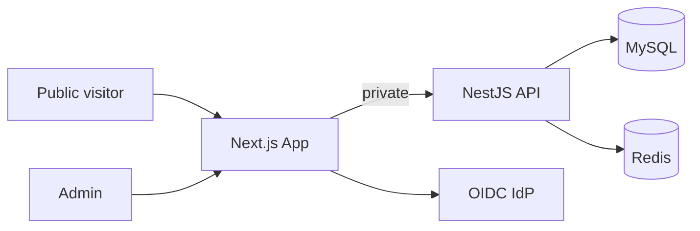

# Portfolio Platform
## Full-stack regulated enterprise template

NestJS Clean Architecture API + Next.js FSD admin & marketing site

---

# Problem

- Portfolio / marketing sites need **CMS**, **RBAC admin**, and **compliance controls**
- Teams rebuild auth, audit, MFA, and public API boundaries on every project
- CTOs need to assess architecture **in minutes**, not days of code reading

---

# Solution

Two paired open-source templates:

| Repo | Role |
|------|------|
| `nestjs-fsd-portfolio-template` | CMS API, auth, RBAC, audit |
| `nextjs-fsd-portfolio-template` | Marketing site + admin + BFF |

Fork → configure white-label env → deploy

---

# C1 — System context

---

# C2 — Containers

- **Marketing SSR** — public pages, CMS content, localized EN/MN
- **Admin dashboard** — FSD features, permission-gated CRUD
- **BFF** — httpOnly JWT, CSRF, allowlisted proxy
- **NestJS API** — Clean Architecture, 24+ controllers
- **MySQL + Redis** — persistence, token blacklist, permission cache

---

# Security model

- BFF: tokens never in `localStorage`
- RBAC: permission codes on API + UI guards
- MFA: TOTP enrollment + step-up for sensitive roles
- CSRF on mutating BFF routes
- Audit interceptor on admin mutations
- GDPR export & erasure workflows

---

# CMS capabilities

- Projects, skills, experiences
- Blog, pricing, navigation tree
- Site settings (hero, SEO, logos, contact)
- Localized content (EN/MN)
- Media upload (S3-compatible)

---

# White-label in 5 minutes

**Env (deploy-time):** `APP_DISPLAY_NAME`, `MFA_ISSUER`, `NEXT_PUBLIC_APP_NAME`

**CMS (runtime):** logos, site name, SEO, hero

**i18n:** `{brandName}` placeholders in marketing copy

See `docs/WHITE-LABEL.md`

---

# Enterprise controls

29-item regulated enterprise checklist with E2E evidence:

- Session refresh + expiry dialog
- BFF allowlist tests
- MFA + OAuth smoke tests
- Audit log retention
- Helm lint in CI

---

# Deployment options

| Target | Pattern |
|--------|---------|
| Railway | 2 services + MySQL + Redis plugins |
| Kubernetes | Helm chart `portfolio-stack` |
| Vercel | Frontend + hosted API |

Same env contract across targets

---

# Observability

- OpenTelemetry (opt-in) — API + frontend
- Sentry DSN (opt-in)
- Structured logging (Winston)
- Health + readiness probes

---

# Adoption path

1. Fork both repos
2. Set brand env vars + run seed
3. Upload logos in site settings
4. Deploy API + frontend
5. Enable MFA / OIDC for production

---

# Links

- API: github.com/devTugu/nestjs-fsd-portfolio-template
- Web: github.com/devTugu/nextjs-fsd-portfolio-template
- C4 docs: `docs/SYSTEM-ARCHITECTURE.md`
- ADRs: `docs/adr/`
- Runbook: `docs/RUNBOOK.md`

**Generate PDF:** `npm run docs:pitch-pdf`
